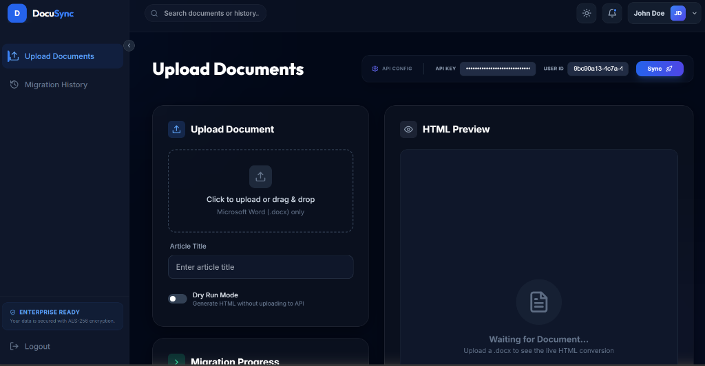
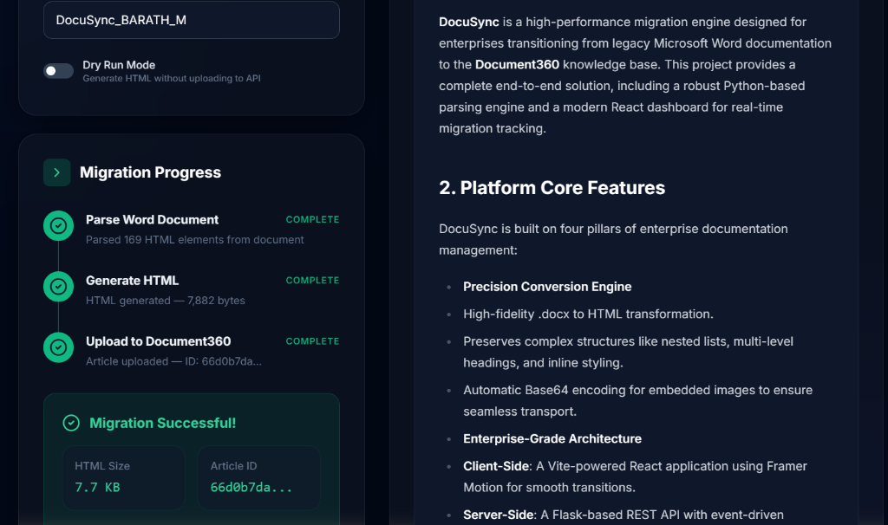

#  DocuSync: Enterprise Content Migration Suite

DocuSync is a professional-grade migration platform designed to seamlessly transition Microsoft Word documentation into **Document360** knowledge bases. It combines a powerful CLI pipeline with a premium, real-time React dashboard.

---

##  Features

- ** Precision Parsing**: Advanced `.docx` to HTML conversion preserving tables, nested lists, images (base64), and rich formatting.
- ** Real-time Streaming**: Pulse-driven progress tracking via Server-Sent Events (SSE).
- ** Adaptive UI**: Premium enterprise dashboard with full Light/Dark mode support and glassmorphism aesthetics.
- ** Secure Operations**: Encrypted API configuration and local-first document processing.
- **Developer-First**: Clean Python backend and a modern React + Vite frontend.

---

##  Dashboard Overview


*Figure 1: Enterprise-grade migration dashboard with real-time SSE progress tracking*


*Figure 2: Successful migration state with article validation and download options*

---

##  Project Architecture

```
Kovai/
├── migration-task/
│   ├── client/             # Modern React Frontend (Vite, Tailwind, Framer Motion)
│   │   ├── src/
│   │   │   ├── components/ # Sidebar, Header, UI widgets
│   │   │   ├── pages/      # Landing, Auth, Migrator Dashboard
│   │   │   └── main.jsx    # Router & Flow control
│   ├── server/             # Flask Backend (SSE, Document Engine)
│   │   ├── app.py          # Migration API & Streaming Engine
│   │   ├── parser.py       # Core conversion logic
│   │   └── uploader.py    # Document360 API Integration
└── README.md
```

---

##  Getting Started

### 1. Prerequisites
- Python 3.10+
- Node.js 18+
- [Document360 API Token](https://docs.document360.com/docs/api-token)

### 2. Backend Setup
```bash
cd migration-task/server
python -m venv venv
source venv/bin/scripts/activate  # Windows: .\venv\Scripts\activate
pip install flask flask-cors python-docx requests lxml
python app.py
```
*Server runs on: `http://localhost:5000`*

### 3. Frontend Setup
```bash
cd migration-task/client
npm install
npm run dev
```
*Dashboard runs on: `http://localhost:5173`*

---

##  Configuration

The dashboard allows on-the-fly configuration, but for CLI usage, set:
- `D360_API_KEY`: Your Document360 API token.
- `D360_PROJECT_ID`: Your project version ID.

---

##  Tech Stack

- **Frontend**: React 18, Vite, Tailwind CSS, Framer Motion, Lucide Icons.
- **Backend**: Flask, SSE (Server-Sent Events), Python-Docx.
- **API**: Document360 v2 REST API.
- **Conversion Engine**: Custom LXML-based Word-to-HTML pipeline.

---


##  Element Mapping

| Word Element | HTML Mapping | CSS Features |
|---|---|---|
| Heading 1-6 | `<h1>` - `<h6>` | Outfit Font, Bold Weight |
| Paragraphs | `<p>` | Inter Font, Optimal Leading |
| Tables | `<table>` | Glass-styled, Zebra stripes |
| Embedded Images | `` | Base64 Encoded |
| Lists (Nested) | `<ul>` / `<ol>` | Multi-level indent support |
| Code Blocks | `<pre><code>` | Custom syntax highlighting |

---

© 2026 DocuSync Enterprise Workspace. Designed for the Kovai.co Assessment.
